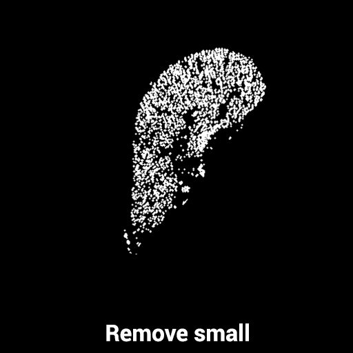

# Liver Segmentation from CT scans


## About
In this documentation, I will explain the main ideas used in this project. The problem is the following:

Given 2 matrices `HU.in` (CT scan in Hounsfield units) and `seg.in` (approximative segmentation mask), the program needs to find an optimised segmentation of the liver.

Example of `HU.in` and `seg.in` images:
<div>
    
    
</div>

Initial research was done in the [this](liver_seg_research.ipynb) notebook. There you can find more intermediate steps (some of them are not used in the final version) and other attempts which didn't work properly.


## How to use it
```bash
# Install the packages from `requirements.txt`
cd implementation/src
pip install -r requirements.txt

# After running the program, output can be found in the `../output/testcase_id/` directory
general-case: python main.py [path_to_hu.in] [path_to_seg.in] 
example:      python main.py ../input/121/121-HU.in ../input/121/121-seg.in
```


## Project structure

Before talking about some intermediate milestones, I will describe the structure of the project:

- The main idea of this class is to make a `pipeline` of `transformations` (similar to a list of transformations) which can be applied to a given image.
- This approach make the project *`scalable`*, because we can easily *`add`*, *`remove`* or *`replace`* any transformation we want from the pipeline.
- Another benefit of using this idea is that the application is more *`robust`*. For example, we can perform `type checking`: if the input image hasn't the *`required type`*, raise an error. Another example could consist in different *`shapes`* between the input and the output image.

```python
class Pipeline:
    def __init__(self, name):
        self.name = name
        self.transformations = []
    
    # Function signatures
    def add(self, transformation)
    def remove(self, transformation_name)
    def replace(self, transf_to_replace_name, new_transf)
    def transform(self, image)
    def show(self)
```

- The class shown below is the representation of a `transformation` used in the project
- It has a *`name`* and a *`function reference`* (the actual transformation)  

```python
class Transformation:
    def __init__(self, name, func):
        self.name = name
        self.func = func

    # Function signature
    def apply(self, image)
```

- For a better understannding, we can look at the following piece of code:

```python
def run_pipeline():
    # Create the pipeline
    pipeline = Pipeline('pipeline')
    # Add some transformations to the pipeline
    pipeline.add(Transformation('Identity',     lambda img: img))
    pipeline.add(Transformation('Binarization', lambda img: binarize(img)))
    # Sequentially apply the transformations to the given image `hu_mat`
    liver_mask = pipeline.transform(hu_mat)
```

## Segmentation system pipeline

Before talking about each main step, I will explain how I managed to perform the liver segmentation in the following cases:

- The CT scanned only a small portion of the liver (which has the shape of an ellipse)
- The CT scanned the liver and a lot of smaller regions around it

The only difference between the `big_liver` and `small_liver` pipelines is that in the *small* case, the liver is highlighted and the very small regions around it are removed, while in the *big* liver case the regions around the liver are highlighted (this approach leads to good results for both types of segmentation)

The differentiation between *small* and *big* liver cases is done by computing the area of the `Convex Hull` and comparing it with a threshold (*LIVER_VOLUME_THRESHOLD = 15000* is the current threshold used in the project).


The images shown below represent some intermediate steps from the segmentation process:

<div align="center">
    
    
    
    
    
    
    
    
    
        
    
        
    
</div>


### 1. **Slice**
- This step consists in limiting the values (pixels) in the interval [level - window / 2, level + window / 2]
- This allows us to highlight the desired regions and disable some other textures outside the range.
- The `level` and `window` values have different values depending on the case (`small` or `big`) - that's the main difference between these 2 cases.

### 2. **Binarize**
- After limiting the values within a specific range, I `normalized` the image and extracted the `ROI` (region of interest) by computing the `Convex Hull`. Pixels outside the Hull's polygon are set to zero (black).
- After that, the image is `binarized`, using a `threshold_confidence` value (in the current version of the project, threshold = 0.5).

### 3. **Remove small**
- At this step, I removed the `small object` from the image. For the `big` case, I made a mask with the small objects and perfomed an bitwise `AND` operation between the binarized image and the negated mask. For the `small` case, I did the opposite: keep only the objects of size greater than the specified `min_size`.

### 4. **Edges**
- For obtaining the representation for this step, I did several transformations such as `morphology dilation`, followed by a more precise ROI selection, another morphology techniques such as `area closing` + `area opening` and removed another small pixels from the image. At the end a Sobel filtering is done for highlighting the edges. 

### 5. **Morphology**
- This step consists of removing another small pixels from the image (denoising), followed by several morphology dilations. At the end, the `holes` are filled. This thing is helpful for the next step where we generate contour for the final mask.

### 6. **Active contour**
- In this step of the segmentation process, I performed an `active contour` model starting from the `doctor_seg` points. This is a technique for delineating an object outline from a possibly noisy 2D image.

### 7. **Mask**
- This is the last step of the segmentation process and it's very simple: generate a mask (binary image) using the optimised `snake` points: all the pixels outside the `snake` path are going to be zero and all the pixels inside will be set to one. This let us with a well-shaped mask for the liver.

## Conclusion

- A hard problem that I faced during the developement was that the small regions around the liver have had very similar Hounsfield values and the delimitation between them was hard to do.
- Another interesting thing was the diversity of the CT scans, capturing the liver in different sizes and shapes (depending on the position of the scanner). To solve this problem I had to make a little modification (presented above) when segmenting a `"small"` liver comparing to a `"big"` liver.

